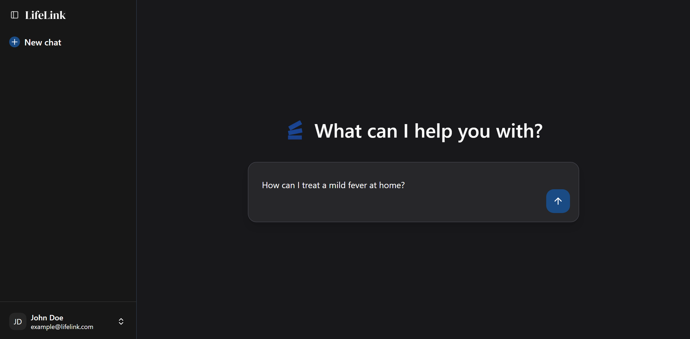
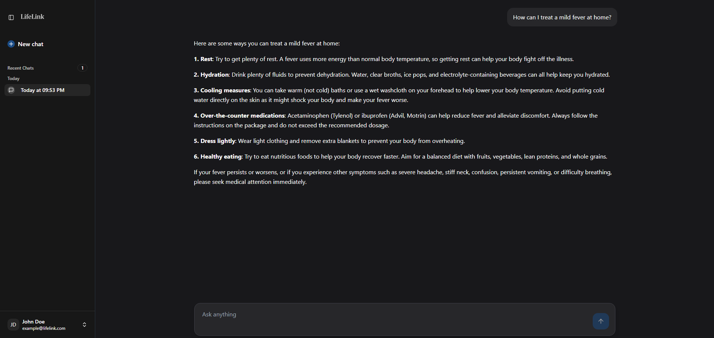

# LifeLink

<!-- Added proper HTML structure for logo section with better alignment -->
<div align="center">
  
  
  
  **Personalized health insights for a balanced life**
  
  [Website Link](https://lifelink-app.vercel.app/) | [Getting Started](#getting-started) | [Backend Repo](https://github.com/erickim73/lifelink_backend)
</div>

---

## Overview

LifeLink is an AI-powered health companion that provides personalized health recommendations and insights to help users achieve their wellness goals. The platform combines cutting-edge machine learning with an intuitive user interface to deliver actionable health guidance.

## Screenshots

<!-- Improved image presentation with proper sizing and captions -->
<div align="center">
  
### Dashboard Overview


### Chat Interface


</div>

## Technical Architecture

### Frontend Stack
- **Framework**: Next.js with TypeScript
- **Styling**: Tailwind CSS
- **UI Components**: Custom components with Framer Motion animations
- **3D Elements**: Custom 3D card components for enhanced user experience

### Backend Infrastructure
- **Framework**: Flask (Python)
- **Hosting**: AWS EC2 t4g.small instance (2 vCPUs, 2 GiB RAM)
- **API**: RESTful API endpoints for health data processing

### AI Model Specifications
- **Base Model**: Mistral-7B-Instruct-v0.3 by Mistral AI
- **Fine-tuning Datasets**: 
  - MedQuAD Dataset (Medical Question Answering)
  - MedRedQA Dataset (Medical Reddit Q&A)
- **Optimization**: IQ1_S quantization using llama.cpp for efficient inference
- **Specialization**: Medical question answering and health guidance

## AI Model Details

**Mistral-7B-Instruct-v0.3** is a 7-billion parameter large language model developed by Mistral AI, specifically designed for instruction-following tasks. The model has been fine-tuned on medical datasets to provide accurate health information and guidance.

**Model Optimization**: The model uses llama.cpp's IQ1_S quantization format, which significantly reduces model size while maintaining performance. This optimization enables real-time health consultations with minimal latency on our AWS EC2 infrastructure.

## Getting Started

### Prerequisites
- Node.js 18 or higher
- Python 3.8 or higher
- AWS CLI (for deployment)

### Frontend Setup

```bash
# Clone the repository
git clone https://github.com/erickim73/lifelink_frontend.git
cd lifelink_frontend

# Install dependencies
npm install

# Start development server
npm run dev
```

### Backend Setup

```bash
# Clone the backend repository
git clone https://github.com/erickim73/lifelink_backend.git
cd backend

# Create and activate virtual environment
python -m venv venv
source venv/bin/activate  # Windows: venv\Scripts\activate

# Install dependencies
pip install -r requirements.txt

# Start Flask server
python app.py
```

## Use Cases

**Symptom Assessment**  
Get initial guidance on health symptoms and when to seek professional care

**Medication Information**  
Learn about medications, their effects, and potential interactions

**Preventive Care**  
Receive evidence-based recommendations for maintaining optimal health

**Wellness Planning**  
Create personalized health and fitness plans tailored to your goals

**Health Education**  
Access reliable medical information and clear explanations of health concepts


## Technology Stack

| Component | Technology |
|-----------|------------|
| Frontend Framework | Next.js + TypeScript |
| Styling Framework | Tailwind CSS |
| Animation Library | Framer Motion |
| Backend Framework | Flask (Python) |
| AI Model | Mistral-7B-Instruct-v0.3 |
| Model Optimization | llama.cpp (IQ1_S) |
| Cloud Hosting | AWS EC2 t4g.small |
| Containerization | Docker |

## Security & Privacy

**Data Protection**  
All health data is encrypted in transit and at rest using industry-standard protocols

**Privacy Compliance**  
HIPAA-compliant data handling practices with user anonymization

**Data Retention**  
No personal health information is stored permanently on our servers

**Access Control**  
Enterprise-grade security protocols protect user data and system integrity

## Important Medical Disclaimer

LifeLink is designed to provide general health information and educational content. This platform should not replace professional medical advice, diagnosis, or treatment. Always consult with qualified healthcare providers for serious health concerns or before making significant changes to your health regimen.


---

**Committed to improving health outcomes through technology**